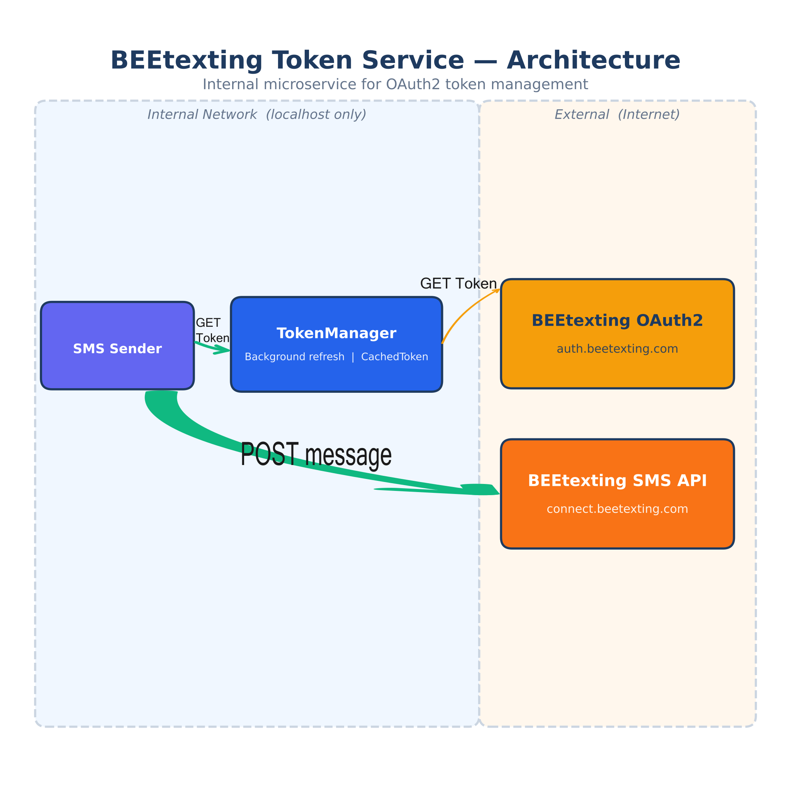
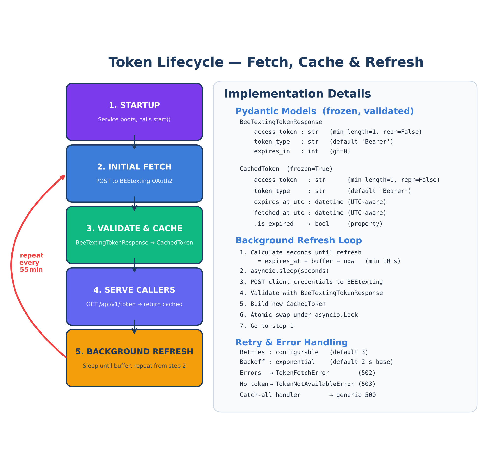
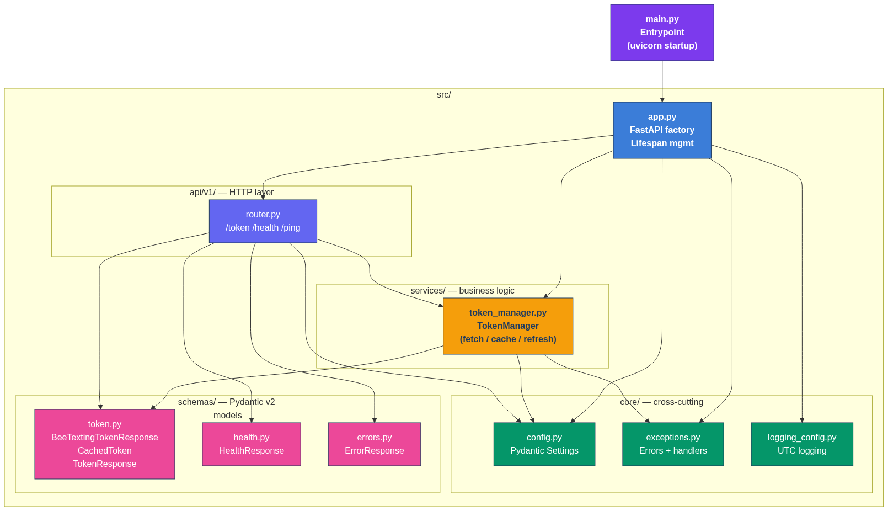
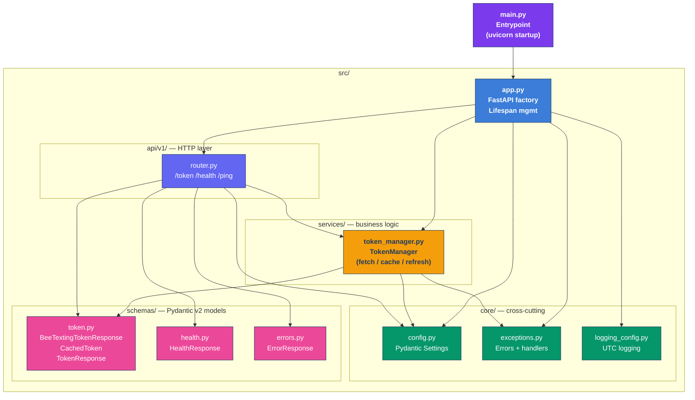

# BEEtexting Token Service

Internal microservice that manages BEEtexting OAuth2 tokens. It fetches tokens via the **client-credentials** flow, caches them in memory as validated **Pydantic v2 models**, and **proactively refreshes** them before expiry using a background asyncio loop.

Sibling microservices (e.g. the SMS sender, worklist service) call `GET /api/v1/token` to obtain a ready-to-use Bearer token instead of managing credentials themselves.

---

## Architecture



**How it works:**

1. Sibling services call the Token Service (`GET /api/v1/token`) to get a cached Bearer token.
2. The Token Service's background loop refreshes the token from BEEtexting's OAuth2 endpoint before it expires.
3. Sibling services use the token directly against BEEtexting's SMS API (`connect.beetexting.com`).

The Token Service binds to **localhost only** (`127.0.0.1:8100`) — it is never exposed to the internet. Only internal services on the same server can reach it.

---

## Token Lifecycle



| Phase | What happens |
|-------|-------------|
| **Startup** | `TokenManager.start()` is called during FastAPI lifespan |
| **Initial fetch** | `POST` to `auth.beetexting.com/oauth2/token/` with client credentials |
| **Validate & cache** | Raw JSON is validated through `BeeTextingTokenResponse`, then stored as a frozen `CachedToken` |
| **Serve callers** | `GET /api/v1/token` returns the cached token instantly (no HTTP call) |
| **Background refresh** | Sleeps until `buffer` seconds before expiry, then repeats from "Initial fetch" |

The token is refreshed **5 minutes before expiry** by default (configurable via `TOKEN_REFRESH_BUFFER_SECONDS`). With a 1-hour token lifetime, this means ~1 refresh request per hour.

---

## Quick Start

```bash
# 1. Install dependencies (requires uv — https://docs.astral.sh/uv/)
uv sync --all-extras

# 2. Configure credentials
cp .env.example .env
# Edit .env with your real BEEtexting credentials

# 3. Run the service
uv run python main.py
# → Listening on http://127.0.0.1:8100

# 4. Verify it's working
curl http://127.0.0.1:8100/api/v1/health
curl http://127.0.0.1:8100/api/v1/token
```

---

## API Endpoints

| Method | Path | Description | Response |
|--------|------|-------------|----------|
| `GET` | `/api/v1/token` | Returns the current Bearer token + API key + expiry | `TokenResponse` |
| `GET` | `/api/v1/health` | Health check — reports `healthy` or `degraded` | `HealthResponse` |
| `GET` | `/api/v1/ping` | Bare-minimum liveness probe (no dependencies) | `{"ping": "pong"}` |
| `GET` | `/docs` | Interactive OpenAPI (Swagger UI) documentation | HTML |
| `GET` | `/redoc` | ReDoc API documentation | HTML |

### Example: `GET /api/v1/token`

```json
{
  "ok": true,
  "access_token": "eyJhbGciOiJSUzI1NiIsInR5cCI6IkpXVCJ9...",
  "token_type": "Bearer",
  "expires_at_utc": "2026-04-11T13:00:00+00:00",
  "api_key": "your-api-key-here"
}
```

### Example: `GET /api/v1/health`

```json
{
  "status": "healthy",
  "has_valid_token": true,
  "token_expires_at_utc": "2026-04-11T13:00:00+00:00"
}
```

### Error responses

All errors return a consistent JSON envelope:

```json
{
  "ok": false,
  "error": {
    "code": 503,
    "message": "No valid token is currently available."
  }
}
```

| HTTP Code | When |
|-----------|------|
| `502` | Failed to fetch token from BEEtexting (upstream error) |
| `503` | No valid token in memory (service just started or all retries failed) |
| `500` | Unexpected internal error |

---

## Configuration

All settings are loaded from environment variables (or a `.env` file in the project root). See [.env.example](.env.example) for the full list with descriptions and defaults.

### Required

| Variable | Description |
|----------|-------------|
| `BEETEXTING_CLIENT_ID` | OAuth2 client ID for the BEEtexting M2M application |
| `BEETEXTING_CLIENT_SECRET` | OAuth2 client secret for the BEEtexting M2M application |
| `BEETEXTING_API_KEY` | API key sent as `x-api-key` header on every BEEtexting request |

### Optional (with defaults)

| Variable | Default | Description |
|----------|---------|-------------|
| `BEETEXTING_TOKEN_URL` | `https://auth.beetexting.com/oauth2/token/` | OAuth2 token endpoint |
| `BEETEXTING_SCOPES` | `ReadContact WriteContact SendMessage` | Space-separated OAuth2 scopes |
| `TOKEN_REFRESH_BUFFER_SECONDS` | `300` | Refresh this many seconds before token expiry (min: 30) |
| `TOKEN_RETRY_ATTEMPTS` | `3` | Number of retries on failed token fetch (1–10) |
| `TOKEN_RETRY_DELAY_SECONDS` | `2.0` | Base delay between retries, doubles each time (0.5–30) |
| `HTTP_TIMEOUT_SECONDS` | `10.0` | Timeout for HTTP calls to BEEtexting (1–60) |
| `APP_HOST` | `127.0.0.1` | Host to bind to (localhost = internal only) |
| `APP_PORT` | `8100` | Port to bind to (1024–65535) |
| `LOG_LEVEL` | `INFO` | Logging verbosity: `DEBUG`, `INFO`, `WARNING`, `ERROR`, `CRITICAL` |

All values are validated at startup via **Pydantic Settings**. If a required variable is missing or a value is out of range, the service fails fast with a clear error message.

---

## Usage from Another Service

Sibling microservices call the token endpoint to get a ready-to-use token:

```python
import httpx

# Fetch token from the Token Service
response = httpx.get("http://127.0.0.1:8100/api/v1/token")
data = response.json()

# Use these in your BEEtexting API calls:
token   = data["access_token"]      # → Authorization: Bearer <token>
api_key = data["api_key"]           # → x-api-key: <api_key>
expires = data["expires_at_utc"]    # → know when it goes stale

# Example: send an SMS via BEEtexting
sms_response = httpx.post(
    "https://connect.beetexting.com/prod/message/sendsms",
    headers={
        "Authorization": f"Bearer {token}",
        "x-api-key": api_key,
    },
    params={
        "from": "+1XXXXXXXXXX",
        "to": "+1XXXXXXXXXX",
        "text": "Hello from the microservice!",
    },
)
```

---

## Pydantic v2 Data Models

All data flowing through the service is validated by Pydantic v2 models. Both internal models are **frozen** (immutable) to prevent accidental mutation, and `access_token` fields use `repr=False` to prevent token leaks in logs.

### `BeeTextingTokenResponse` — upstream API validation

Validates the raw JSON from BEEtexting's OAuth2 endpoint before we trust it.

| Field | Type | Constraints | Description |
|-------|------|-------------|-------------|
| `access_token` | `str` | `min_length=1`, `repr=False` | The Bearer token |
| `token_type` | `str` | default `"Bearer"` | Always "Bearer" |
| `expires_in` | `int` | `gt=0` | Seconds until expiry |

Uses `populate_by_name=True` with explicit field aliases matching BEEtexting's JSON keys, so if their API ever renames a field, we change the alias — not our code.

### `CachedToken` — in-memory state

The single token object held by `TokenManager`. Created on every refresh, atomically swapped under an asyncio lock.

| Field | Type | Constraints | Description |
|-------|------|-------------|-------------|
| `access_token` | `str` | `min_length=1`, `repr=False` | The Bearer token |
| `token_type` | `str` | default `"Bearer"` | Always "Bearer" |
| `expires_at_utc` | `datetime` | UTC-aware | When this token expires |
| `fetched_at_utc` | `datetime` | UTC-aware | When this token was fetched |
| `.is_expired` | `bool` (property) | — | `True` if current time >= expiry |

---

## BEEtexting API Rate Limits & Constraints

BEEtexting does **not publicly document** API-level rate limits. The information below was compiled from their documentation portal, pricing pages, FAQ, and carrier-level 10DLC regulations.

### OAuth2 Token Endpoint

| Item | Value |
|------|-------|
| **Token lifetime** | 3600 seconds (1 hour) |
| **Grant type** | `client_credentials` (M2M, no user interaction) |
| **Token request rate limit** | Not documented — returns HTTP `429` if exceeded |
| **Our request rate** | ~1 request/hour (well within any reasonable limit) |
| **Token caching** | Yes — we cache and reuse, refresh 5 min before expiry |

### Account/Plan Message Limits

| Item | Value |
|------|-------|
| **Messages included per month** | 1,000 (all plans) |
| **Overage cost (per message)** | $0.04 |
| **SMS cost (per segment)** | $0.0199 |
| **MMS cost (per segment)** | $0.0399 |
| **SMS segment size** | 160 characters |
| **Messages > 160 chars** | Billed as multiple segments |
| **API access** | Enterprise plan only ($1,969.50/mo) |
| **Message history retention** | Professional: 1yr, Premium: 2yr, Enterprise: unlimited |

### Carrier-Level 10DLC Throughput (the real bottleneck)

BEEtexting uses 10-digit long code (10DLC) numbers. **Carriers enforce per-second throughput limits** based on your brand's Trust Score from The Campaign Registry (TCR), regardless of what BEEtexting's API allows.

#### Standard Brand Campaigns

| Trust Score | AT&T (MPS) | T-Mobile (MPS) | Verizon (MPS) | **Total MPS** |
|-------------|-----------|----------------|--------------|---------------|
| 75–100 | 75 | 75 | 75 | **225** |
| 50–74 | 40 | 40 | 40 | **120** |
| 1–49 | 4 | 4 | 4 | **12** |
| 0 (Low Vol) | 4 | 4 | 4 | **12** |

> MPS = Messages Per Second

#### Sole Proprietor (worst case)

| Carrier | Limit |
|---------|-------|
| AT&T | 0.25 MPS (15 msg/min) |
| T-Mobile | 1 MPS per number (1,000 msg/day cap) |
| Verizon | 1 MPS per number |
| **Total** | **2.25 MPS** |

#### What this means for us

- **Token requests are not a concern.** We make ~1 request/hour. Any rate limit is orders of magnitude above that.
- **Message throughput is carrier-gated**, not API-gated. The real limit is 4–75 MPS per carrier depending on Trust Score.
- **Monthly volume is plan-gated.** 1,000 included messages, then $0.04/msg overage.
- **Our `TOKEN_REFRESH_BUFFER_SECONDS=300` is correct.** One fresh token per hour is optimal.

---

## Error Handling

The service uses a centralised exception hierarchy:

```
Exception
  └── TokenServiceError (base, 500)
        ├── TokenFetchError (502) — upstream BEEtexting call failed
        └── TokenNotAvailableError (503) — no valid token in memory
```

All exceptions are caught by FastAPI error handlers registered at startup. Every error response uses the same JSON envelope (`{"ok": false, "error": {"code": N, "message": "..."}}`), so consuming services can parse errors reliably.

Unhandled exceptions are caught by a generic handler that logs the full traceback but returns a generic message — internal details never leak to callers.

---

## Logging

- **Format:** `2026-04-11T12:34:56.789+00:00 | INFO | module:func:42 | message`
- **Timezone:** All timestamps are UTC with `+00:00` suffix
- **Output:** stdout (for Docker / systemd capture)
- **Level:** Configurable via `LOG_LEVEL` env var
- **Noisy loggers suppressed:** `httpx`, `httpcore`, `uvicorn.access` set to `WARNING`

---

## Testing

```bash
# Run all tests with verbose output
uv run pytest -v

# Run with coverage report
uv run pytest --cov=beetexting_token_service --cov-report=term-missing

# Run only a specific test class
uv run pytest tests/test_token_manager.py::TestCachedTokenSchema -v

# Lint check
uv run ruff check src/ tests/
```

### Test coverage

- **37 tests** across 3 test files
- **85%+ code coverage**
- All HTTP calls are mocked with `respx` — tests never touch real BEEtexting

| Test file | What it covers |
|-----------|---------------|
| `test_config.py` | Settings validation, defaults, field constraints |
| `test_token_manager.py` | Token fetch, retry logic, expiry, background refresh timing, Pydantic model validation (frozen, repr, min_length, aliases, is_expired) |
| `test_api.py` | API endpoint responses (token, health, ping), error responses |

---

## Project Structure



> The diagram above is rendered from the Mermaid source below. GitHub renders it natively; for offline viewing re-run `python docs/render_project_structure.py`.



```
beetexting_token_service/
├── main.py                                  # Entrypoint (uvicorn startup)
├── pyproject.toml                           # Dependencies, ruff, pytest config
├── .env.example                             # Environment variable template
├── .gitignore
├── README.md                                # This file
│
├── src/
│   └── beetexting_token_service/
│       ├── __init__.py
│       ├── app.py                           # FastAPI factory + lifespan management
│       ├── config.py                        # Pydantic Settings (all env vars, validated)
│       ├── exceptions.py                    # Custom errors + FastAPI error handlers
│       ├── logging_config.py                # Structured UTC logging setup
│       ├── schemas.py                       # Pydantic v2 models (frozen, validated)
│       ├── token_manager.py                 # Core: fetch, cache, background refresh
│       └── api/
│           └── v1/
│               └── router.py               # Versioned API endpoints (/api/v1/...)
│
├── tests/
│   ├── __init__.py
│   ├── conftest.py                          # Shared fixtures (fake settings, test client)
│   ├── test_config.py                       # Config validation tests
│   ├── test_token_manager.py                # Core logic + Pydantic model tests
│   └── test_api.py                          # API endpoint tests
│
└── docs/
    ├── generate_diagrams.py                 # Script to regenerate the PNG diagrams
    ├── architecture.png                     # High-level architecture diagram
    ├── token_lifecycle.png                  # Token fetch/cache/refresh lifecycle
    └── project_structure.png                # Module dependency map
```

---

## Regenerating Diagrams

The architecture diagrams are generated programmatically using matplotlib. To regenerate them after making changes:

```bash
# Requires matplotlib (pip install matplotlib)
python docs/generate_diagrams.py
```

This outputs three PNGs into the `docs/` directory:
- `architecture.png` — high-level service architecture
- `token_lifecycle.png` — token fetch/cache/refresh flow with implementation details
- `project_structure.png` — module dependency map

---

## Tech Stack

| Component | Technology | Version |
|-----------|-----------|---------|
| Runtime | Python | 3.12+ |
| Web framework | FastAPI | 0.115+ |
| HTTP server | Uvicorn | 0.34+ |
| HTTP client | httpx | 0.28+ (async) |
| Validation | Pydantic v2 | 2.10+ |
| Configuration | pydantic-settings | 2.7+ |
| Package manager | uv | latest |
| Testing | pytest + pytest-asyncio | 8+ |
| HTTP mocking | respx | 0.22+ |
| Linting | ruff | 0.9+ |
